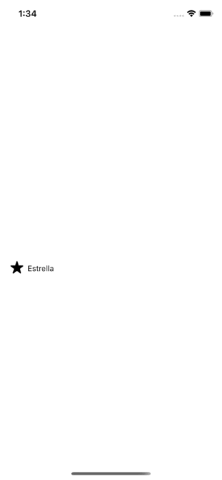

# Like/Reactions Button (SwiftUI)

An simple example of a reactions button (UI like facebook, LinkedIn) written in Swift for SwiftUI. iOS 14+.

<p align="center">

</p>

## Features

* Easy to use.
* Support all SFSymbols and custom text.
* Call a closure after a reaction is selected (see usage below).
* Default reaction.

## Use

Declare your reactions as a tuple, where the first element is the image (SFSymbol) and the second one is the text to show, and put them in an array.

```swift
private let reactions: [(String,String)] = [("star.fill", "Estrella"),("pencil","Lápiz"),("scribble","Rayo"),("heart.text.square.fill", "Carta"), ("sun.min.fill", "Sol")]
```

Next:

```swift
ReactionsView(reactions){ reaction in
         print(reaction.image) // "sun.min.fill"
         print(reaction.text)  // "Sol"
         print(reaction.index) // 4               
}
```

This closure give you a reaction element which is the reaction selected by the user. You can call whatever logic here. For example, I use this for save the reaction in Firebase from a post.

```swift
ReactionsView(K.reactions, defaultReaction: post.reaction) { reaction in
  Task{
    await postVM.setReaction(post:post, value:reaction.index)
  }
}
```

### Instructions

1) Copy the `ReactionsView.swift` file to your projects.
2) (Optional) Modify colors, size, etc.


